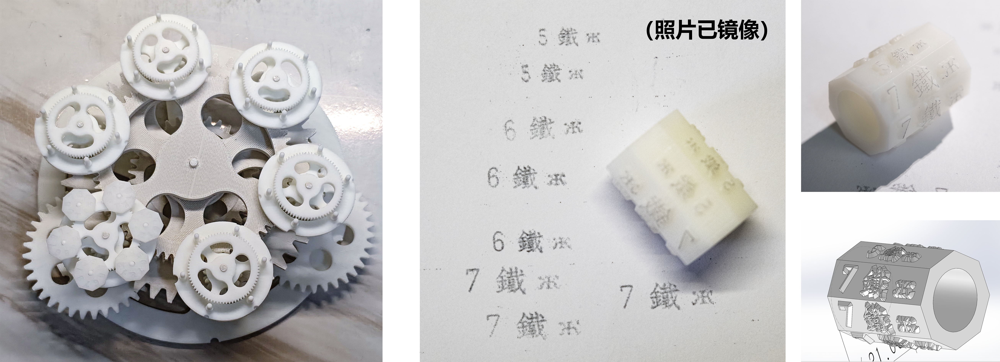
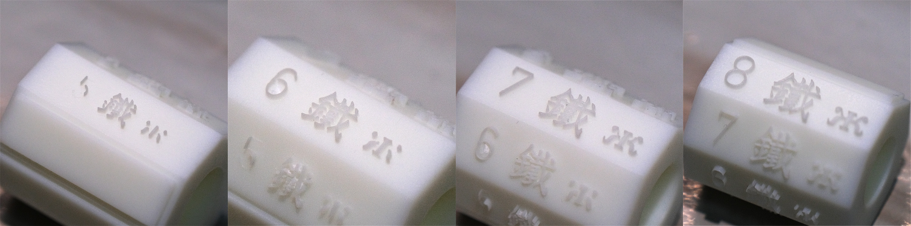
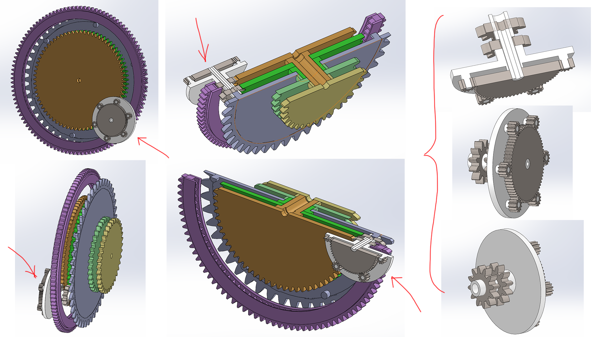
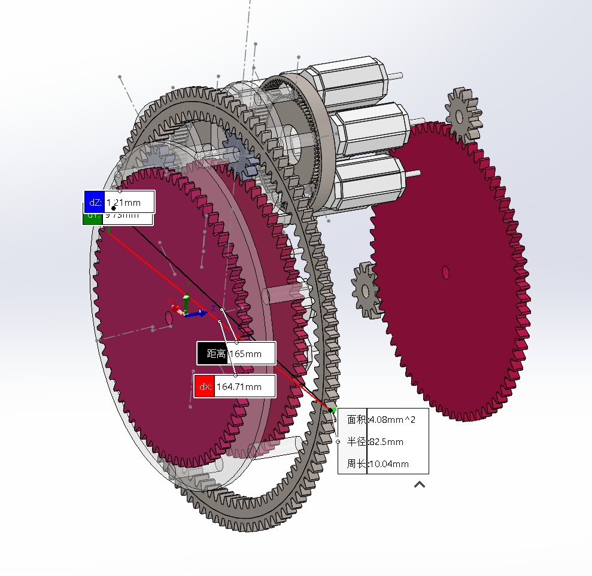
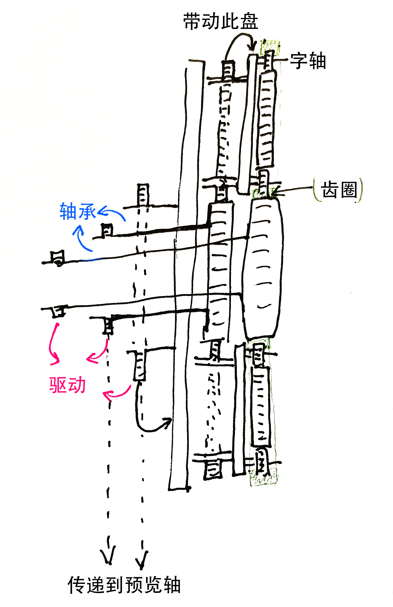
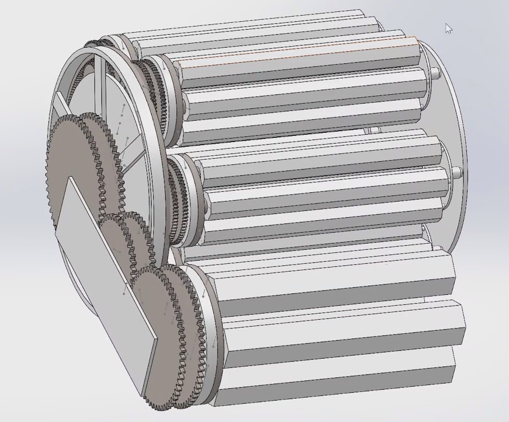
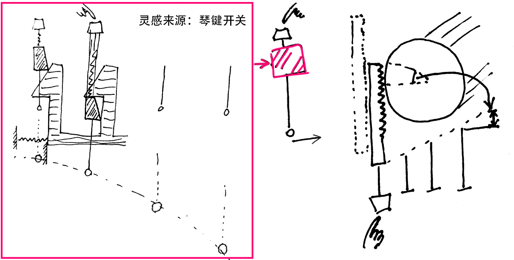

# Chinese Mingkwai Typewriter/明快打字机（中文打字机）

[![CC BY-NC 4.0][cc-by-nc-shield]][cc-by-nc]

本项目使用CC BY-NC 4.0进行许可。This work is licensed under a
[Creative Commons Attribution-NonCommercial 4.0 International License][cc-by-nc].[![CC BY-NC 4.0][cc-by-nc-image]][cc-by-nc]

[cc-by-nc]: https://creativecommons.org/licenses/by-nc/4.0/
[cc-by-nc-image]: https://licensebuttons.net/l/by-nc/4.0/88x31.png
[cc-by-nc-shield]: https://img.shields.io/badge/License-CC%20BY--NC%204.0-lightgrey.svg

这是一个开源项目，欢迎DIYer在此基础上转载/改进/魔改，但请标注来源。禁止盗用、未授权的商用。

## 背景

这是一个我的个人项目，我试图用现代科技来低成本的复现明快打字机，因此不拘泥于纯机械的执念，我的目标是先快速将他运行。

另外，低成本的实现也能帮助更多人自己做或者研究这个东西。

## 成本记录

| 材料\工艺 | 价格  |
| ----- | --- |
| Todo  |     |

## 进度

（update 20250424）**结构测试_v0.2.2 (for 3Dprint)：** 将转筒的齿轮编码部分用3D打印制作了一下，用于实际测试装配、尺寸、运动、误差等情况。文件内有这些模型的sw文件（主文件为“大筒装配体”）和stl文件。可直接打印，前缀为所需数量。装配与演示情况见视频：[【开源计划】低成本明快打字机设计方案第二期_哔哩哔哩_bilibili](https://www.bilibili.com/video/BV1TwLZzwEFX/)

文字滚筒也测试了带拔模角度（1mm, 30°）的3D打印模型，能很好的解决小字体下破损的问题。但这种模型的建模目前还未找到很好的办法制作。这个测试模型是用solidworks的拔模功能手调微操做出来的，特别麻烦，无法扩展到大的正式版制作。

---

（update 20250401）光固化树脂打样了一个带字的字轴，如下图，文字凸起均为1mm，数字是字体的高度，单位mm。6mm及以下的字号可能会出现细线缺失的问题。而即使是8mm的大字，点或细线部分，我用手去扣动，感觉牢固性也堪忧。目前在寻找学习如何制作一个下大上小的那种锥形刻面文字的建模效果。solidworks做这种模型无力，得换工具了。

---

（update 20250319）稍微精细的建模了转轮组比较重要的运动部分，以便打样测试运动。这部分的sw模型已上传（结构测试_v0.2.1），并且附带有齿轮运动配合关系。

todo：

- 测试当前尺寸下文字雕刻出的效果以及配合墨带印字的清晰度。以便最终确定核心机构的尺寸

- 实际验证没问题后，加上轴承，并且优化解耦出的三个齿轮的动力传动。

---

（update 20250316）紧凑的新结构初步验证完毕，可单独控制三个红齿轮的角度，从而完全将运动独立出来，如上图所示。带有预览轴的联动部分以及结构细节以后做。（结构测试_v0.2.0）

---

（update）简单设想了一个更紧凑的方案，理论上应该兼容机械编码，实际参数和设计还未验证。

---

目前设计了3组齿轮独立检索字的结构，齿轮的控制初步设计使用电机控制角度以此检索对应文字的轴。（字模滚筒_v0.1）

下一步先以此结构打样出关键配件，齿轮如有通用件则直接买成品。主要任务是对齿轮部分进行运动验证。

按理说，“电机控制角度”也可以用什么机械结构来实现，但我实在搞不懂。

【我所理解的原始专利对最细轴的控制方法，是用一个类似牙刷样的齿轮齿条去拨动，但是个人感觉那样太不可靠了，干脆都用同样设计思路迭代三层的齿轮为妙。】

机架设计，进纸机构等还没做。

电控的部分也还没弄。

---

**目前问题：**

1. 运动配合部分有点乱，而且模拟运动起来非常卡顿。齿轮的轴固定和轴承的部分也没有专门设计。要结合实际打样再做。

2. 最大的主轮的电机没有把模型放进去，实际的主机架和最左侧齿轮之间还需要一个电机。后期要重构这个机芯的模型。

**（update）关于机械编码实现的设想：**

1. 参考琴键开关的结构，可以实现纯机械的按钮位置编码，配合带位置编码的圆盘和弹簧，利用前文设计的多层嵌套。也许能够实现完全纯机械的结构。但是直觉会很复杂的结构，材料强度和按压的力度也不知道能否在可接受范围内。需要打样测试。（下图草稿）

2. 在初代专利图中存在一个阶梯盘，猜测可根据阶梯实现位置定位。尚没有研究具体如何配合运动？一种可能是通过正反转来归位，
   键盘控制一个卡扣的位置使得滚筒卡在特定阶梯上。另一个问题在于如何做成3级嵌套？以及具体正反转的实现？（目前看可行性不如1）

## 文件详情

### 字表

所有文件的基础来自于网站https://mingkwai.atelier-anchor.com/

但此网站目前（截至2025年3月2日）暂时更新不可见。

- 检索轮用：这些字是用在预览轴上的，可以打印出来贴在轴上（低成本）。

- 字模用：以此镜像文字雕刻在字轴上，用以打字。

- 字体文件：网站上所用的汉字字体副本。

- 字表pdf：原始网页的副本。

### 带v0.x.x版本号的文件夹

齿轮组与字轴滚筒的联动设计，其齿轮参数和轴的参数已基本确定。后续需要完善机架部分，以及放纸的部分的联动。

### 键盘标注

对照着打字机键盘位置和字表上的文字位置的记录。

### 研究笔记

一些想到的随笔，设想，实现计划等，很乱。（Todo：合并整理到readme中）
