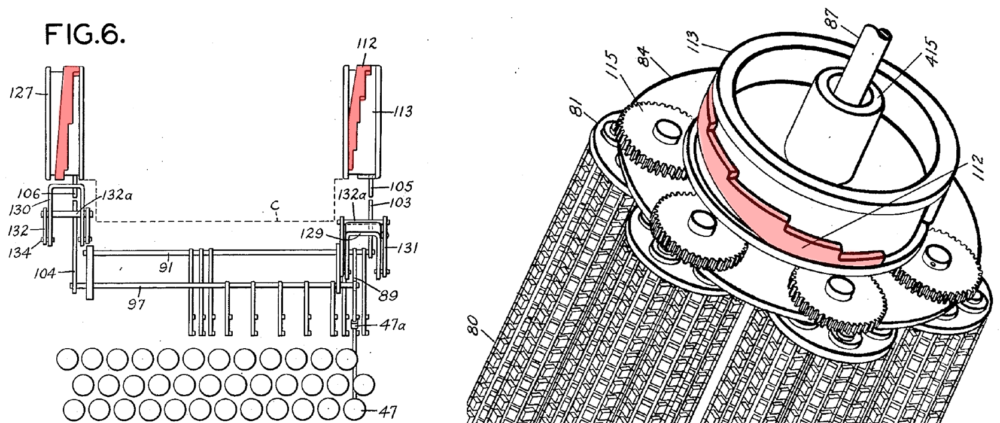

# mingkwai-typewriter/明快打字机

## 权限

这是一个开源项目，欢迎在此基础上转载/改进/魔改，但请标注来源。禁止未授权的商用。

## 背景

这是一个我的个人项目，我试图用现代科技来低成本的复现明快打字机，因此不拘泥于纯机械的执念，我的目标是先快速将他运行。

另外，低成本的实现也能帮助更多人自己做或者研究这个东西。

## 进度

（update）简单设想了一个更紧凑的方案，理论上应该兼容机械编码，实际参数和设计还未验证。

目前设计了3组齿轮独立检索字的结构，齿轮的控制初步设计使用电机控制角度以此检索对应文字的轴。

下一步先以此结构打样出关键配件，齿轮如有通用件则直接买成品。主要任务是对齿轮部分进行运动验证。

按理说，“电机控制角度”也可以用什么机械结构来实现，但我实在搞不懂。

【我所理解的原始专利对最细轴的控制方法，是用一个类似牙刷样的齿轮齿条去拨动，但是个人感觉那样太不可靠了，干脆都用同样设计思路迭代三层的齿轮为妙。】

机架设计，进纸机构等还没做。

电控的部分也还没弄。

**目前问题：**

1. 运动配合部分有点乱，而且模拟运动起来非常卡顿。齿轮的轴固定和轴承的部分也没有专门设计。要结合实际打样再做。

2. 最大的主轮的电机没有把模型放进去，实际的主机架和最左侧齿轮之间还需要一个电机。后期要重构这个机芯的模型。

**（update）关于机械编码实现的设想：**

1. 参考琴键开关的结构，可以实现纯机械的按钮位置编码，配合带位置编码的圆盘和弹簧，利用前文设计的多层嵌套。也许能够实现完全纯机械的结构。但是直觉会很复杂的结构，材料强度和按压的力度也不知道能否在可接受范围内。需要打样测试。（下图草稿）

2. 在初代专利图中存在一个阶梯盘，猜测可根据阶梯实现位置定位。尚没有研究具体如何配合运动？一种可能是通过正反转来归位，
   键盘控制一个卡扣的位置使得滚筒卡在特定阶梯上。另一个问题在于如何做成3级嵌套？以及具体正反转的实现？（目前看可行性不如1）

## 文件详情

### 字表

所有文件的基础来自于网站https://mingkwai.atelier-anchor.com/

但此网站目前（截至2025年3月2日）暂时更新不可见。

#### 检索轮用

这些字是用在预览轴上的，可以打印出来贴在轴上（低成本）。

#### 字模用

以此镜像文字雕刻在字轴上，用以打字。

#### 字体文件

网站上所用的汉字字体副本。

#### 字表pdf

原始网页的副本。

### 字模滚筒

齿轮组与字轴滚筒的联动设计，其齿轮参数和轴的参数已基本确定。后续需要完善机架部分，以及放纸的部分的联动。

### 键盘标注

对照着打字机键盘位置和字表上的文字位置的记录。

### 研究笔记

一些想到的随笔，设想，实现计划等，很乱。
